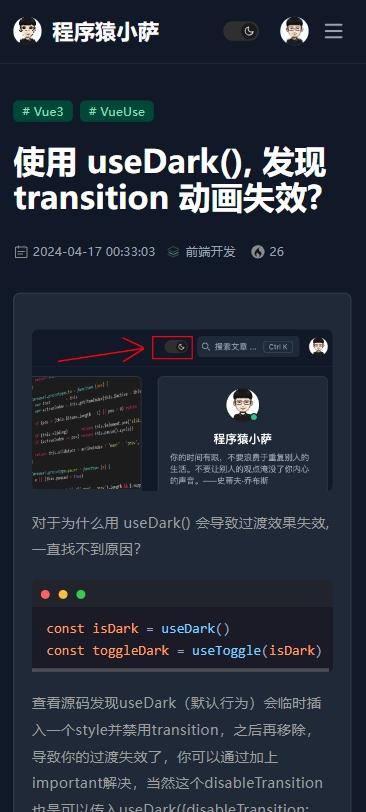

## 一、项目介绍

 `Weblog`  项目就是完成一个完整的前后端分离的博客项目，包含服务端接口API，管理后台以及部署上线流程。这个项目主要介绍使用 `SpringBoot2.6  `  开发一套完整的 RESTful 风格服务端接口 API 和使用 `Vue2` 开发管理后台。（本项目只给小伙伴学习使用的，不能做任何开源商业使用，请尊重作者-🔜[犬小哈](https://www.quanxiaoha.com/)）

### 1.1 项目展示

- 前端线上展示地址：https://blog.arnasoft.site/#/

  - 首页
  
  
  - 详情页
  
  
  - 移动端
       


## 二、使用项目

### 2.1 克隆项目

```
# 克隆项目代码

git clone git@github.com:programmer-xiaosa/weblog.git
```

### 2.2 项目部署

小伙伴们可以使用传统方式部署也可以使用 `docker jenkins` 自动化部署，推荐使用 `docker`

- [Docker 教程](https://www.quanxiaoha.com/docker/docker-tutorial.html)
- [Linux常用命令](https://www.quanxiaoha.com/linux-command/linux-shutdown.html)

## 三、FAQ

1. 没有yarn环境，npm 可以吗？

> 答：可以的，建议使用 yarn，yarn 比 npm 速度快，主要是安装版本统一。

2. npm 下载依赖包失败，卡住？

> 答：本项目采用的事vue3，建议使用 node版本是 v18.12.1.，小伙伴们可以使用 `n` 或者 `nvm` 来切换电脑上的node版本，这样可以使用多个版本的系统，不会冲突。

3. ... 更多问题请到 [Issues](https://github.com/programmer-xiaosa/weblog/issues)查阅，或者有问题请到 [Issues 提问](https://github.com/programmer-xiaosa/weblog/issues/new)。
4. 本项目学习[犬小哈老师](https://www.quanxiaoha.com/)的课程后开发的博客项目，代码基本跟源码一致，只做部分修改和优化，，修改和优化可以到生产环境看下，[点这里](https://blog.arnasoft.site/#/)。小伙伴们可以参考学习，希望大家多多支持犬小哈老师的课程，我个人认为犬小哈老师的图文教程是特别棒的，肯定会有收获

## License

[MIT](https://github.com/programmer-xiaosa/Weblog/blob/main/LICENSE), by [programmer-xiaosa](https://github.com/programmer-xiaosa/Weblog/commits?author=programmer-xiaosa)

喜欢或对你有帮助的话，请你点一个星星 <strong style='color:red;'>star</strong> 鼓励我，或者您有更好的建议和意见，请提出来告知我，可以留言 [Issues](https://github.com/programmer-xiaosa/weblog/issues/new)。希望能够帮助到你学习！Thanks